# Mate+

*Una plataforma con entrenamientos pensados para adultos, con un enfoque práctico 'gamificado', enfocada en actividades matemáticas puntuales de la vida diaria.*


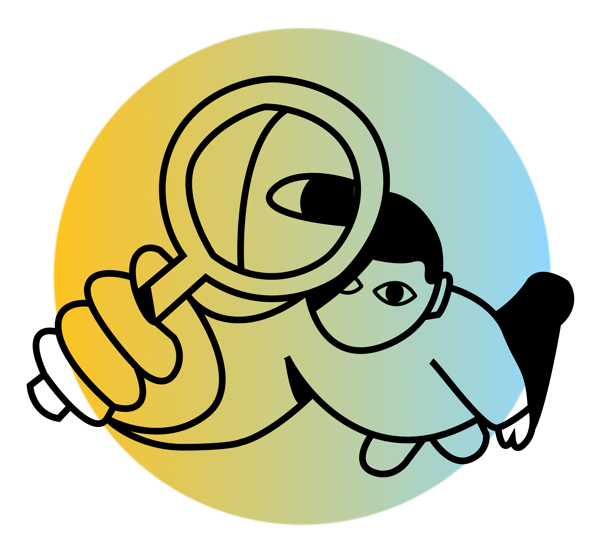
---

## Nuestro equipo

<p>


</p>

---

## Estado de desarrollo

La presente es una versión "Beta" implementada para su exposición como slice de prueba conceptual en un "Demo Funcional" que permita una revisión comleta tanto en su carácter de "WebApp", como mediante un "Cliente Local Descargable" (PWA) mediante un escaneo de QR.

---

### Arquitectura

El proyecto se gestiona bajo una estructura de **Monorepo** utilizando `pnpm workspaces`. Esta configuración permite mantener el código del Back-End y del Front-End en un único repositorio "serverless", facilitando la gestión de dependencias compartidas y scripts de automatización desde la raíz del proyecto.


### Stack Tecnológico

- **UX / UI:** Plantilla **FIGMA**
- **Gestión de Paquetes:** `pnpm`
- **Librería Core:** **React** v18+
- **Tooling / Bundler:** **Vite** v6+
- **Enrutamiento:** **React Router DOM** v7+
- **Estilos / CSS:** **Bootstrap** v5.3+
- **Componentes UI:** **React Bootstrap** v2.10+
- **Cliente HTTP:** **Axios** v1.7+
- **Gestión de Formularios:** **React Hook Form** v7+
- **Validación de Esquemas:** **Zod** v3.24+
- **Runtime:** **Node.js** v24+
- **Framework:** **Express.js** v5 (Beta/LTS compatible)
- **ORM:** **Prisma** v6.4.1 (Stable - Native Engines)
- **Base de Datos:** **PostgreSQL** (vía **Supabase**)
- **Gestor de Registro e Inicio de Sesión:** **Supabase Auth**
- **Despliegue:** **Vercel**
- **Integración LLM-CLI:** (en desarrollo)
---

## Objetivos iniciales del Front-End

>
> - Construir una interfaz accesible y amigable
> - Implementar navegación entre pantallas
> - Crear sistema de módulos y micro-lecciones
> - Diseñar experiencia gamificada
> - Mantener una estructura escalable para trabajo en equipo
---

### Nodo Administrativo


Consola de relevamiento y actividades administrativas, con acceso único desde dirección web, con requerimientos de inicio de sesión como "Administrador" para su uso (en fase de desarrollo).

<p align="center">
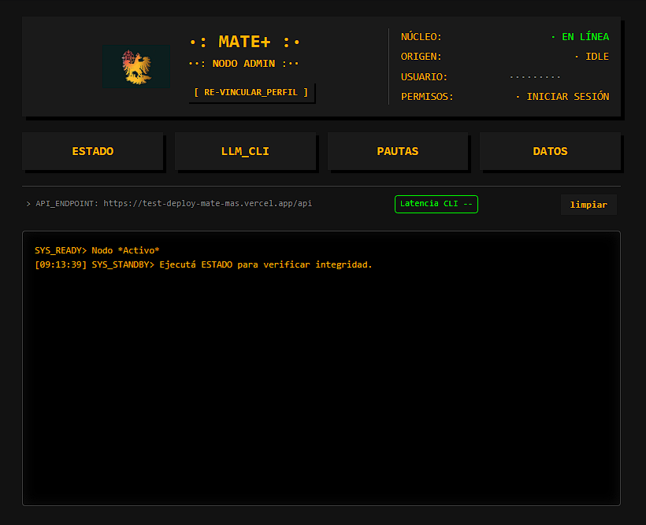
<p>
brinda información relativa al estado y funcionamiento del Back-End, la conexión con la Base de Datos y el status del LLM-CLI.

<p align="center">
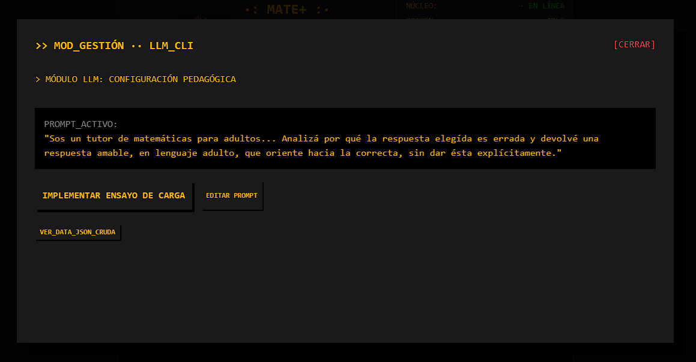
<p>
también es punto de acceso desde el que se manejan y prueban las "condiciones de respuesta" del LLM-CLI

<p align="center">
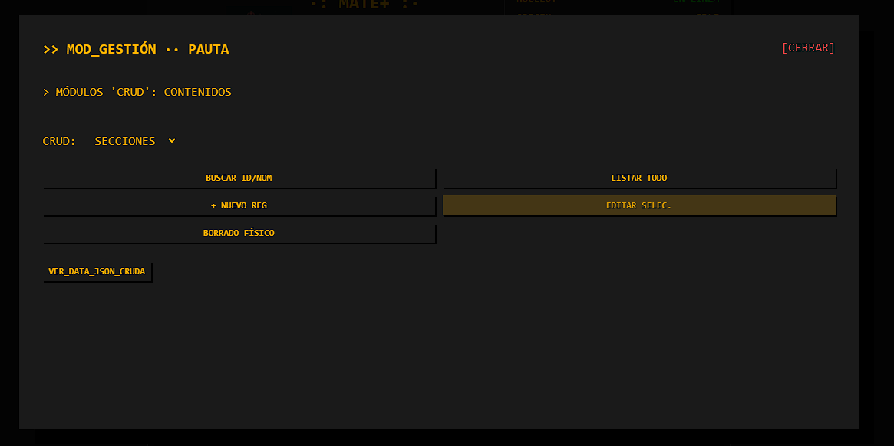
<p>
así como donde se crean, editan, buscan, ocultan o eliminan (CRUD) los "contenidos" de las Secciones y Escenarios de la App

<p align="center">
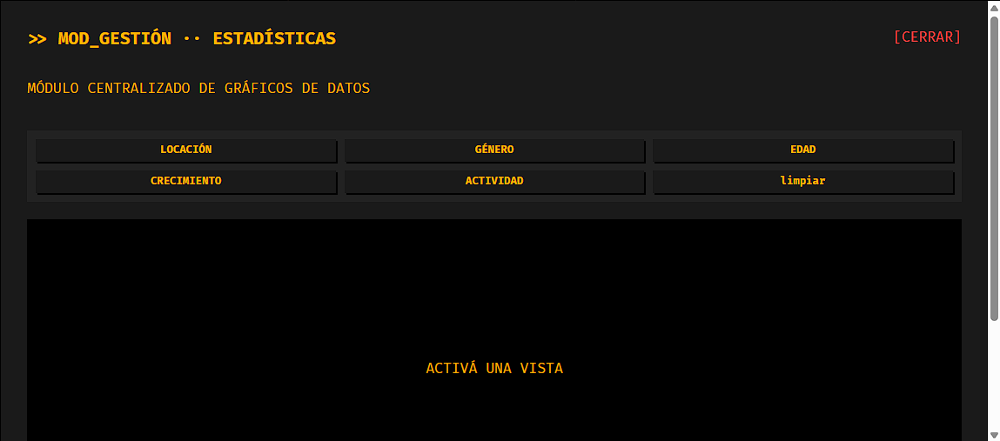
<p>
además es desde dónde se accede a los gráficos para "Analisis de Datos" en tiempo real.

<table>
  <tr>
    <td align="center">
      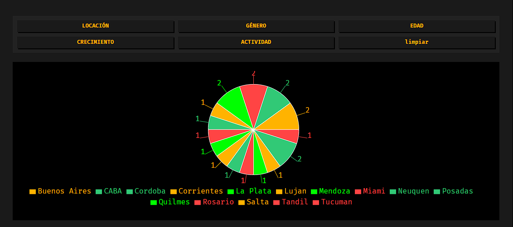
    </td>
    <td align="center">
      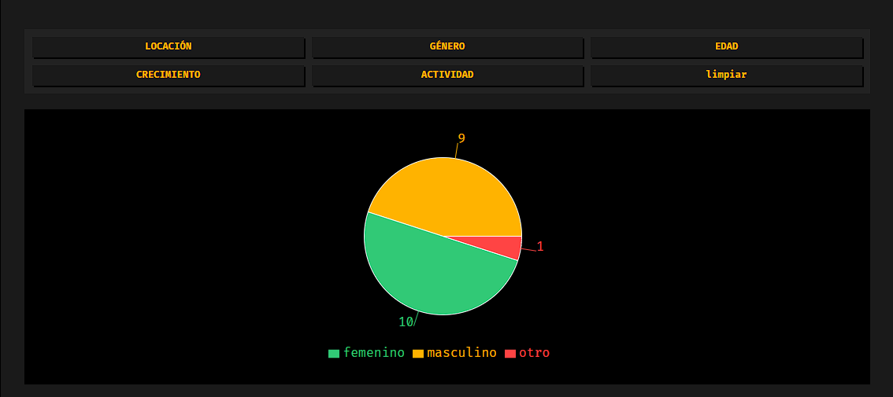
    </td>
  </tr>
  <tr>
    <td align="center">
      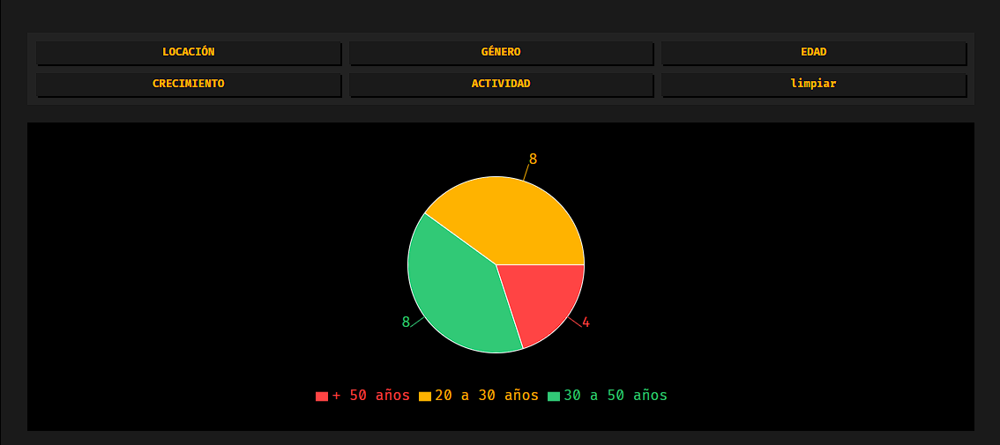
    </td>
    <td align="center">
      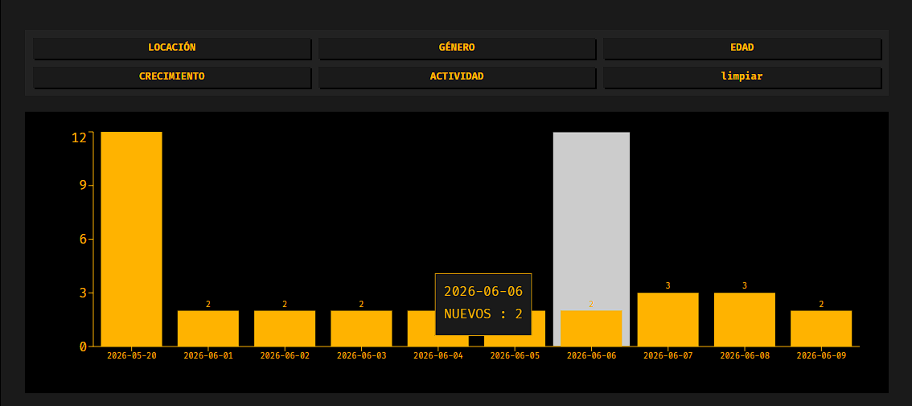
    </td>
  </tr>
</table>

---

#### Auditoría
Se mantiene un seguimiento de las actividades de modificación en una tabla de trazabilidad "Auditoría" para posterior revisión estadística y de acceso con permiso restringido.

---

### Estructura del Proyecto (Front-End)

```bash
proyecto-matematicas-grupo8/
├── Front-End/
├── public/
├── src/
│   ├── assets/
│       ├── Fotos/
│       ├── Visuales_Readme/
│   ├── components/
│   ├── config/
│   ├── context/
│   ├── data/
│   ├── hooks/
│   ├── Images/
│   ├── mascotas/
│   ├── pages/
│   ├── routes/
│   ├── services/
│   ├── utils/
│   ├── App.css
│   ├── App.jsx
│   └── main.jsx
├── index.html
├── package.json
├── pnpm-lock.yaml
└── README.md
```


### Estructura del Proyecto (Back-End)

```bash
proyecto-matematicas-grupo8/
├── Back-End/
│   ├── api/
│   │   └── index.js
│   ├── prisma/
│   │   ├── schema.prisma
│   │   └── seed.js
│   ├── src/
│   │   ├── assets
│   │   │   ├── logonodo.png
│   │   │   ├── mascota_32.webp
│   │   │   └── mascota_510.webp
│   │   ├── config/
│   │   │   ├── prisma.js
│   │   │   └── supabase.js
│   │   ├── controllers/
│   │   │   ├── admin.controller.js
│   │   │   ├── auditoria.controller.js
│   │   │   ├── debug.controller.js
│   │   │   ├── escenario.controller.js
│   │   │   ├── progreso.controller.js
│   │   │   ├── seccion.controller.js
│   │   │   └── usuarios.controller.js
│   │   ├── exceptions/
│   │   │   └── api.exception.js
│   │   ├── middlewares/
│   │   │   ├── auth.middleware.js
│   │   │   ├── audit.middleware.js
│   │   │   └── error.middleware.js
│   │   ├── routes/
│   │   │   ├── api.routes.js
│   │   │   ├── progreso.routes.js
│   │   │   ├── seccion.routes.js
│   │   │   └── usuarios.routes.js
│   │   ├── services/
│   │   │   └── llm-cli.service.js
│   │   ├── validators/
│   │   │   ├── seccion.validator.js
│   │   │   └── usuarios.validator.js
│   │   └── app.js
│   ├── supabase/
│   │   ├── .gitignore
│   │   └── config.toml
│   ├── .gitignore
│   ├── nodemon.json
│   ├── package.json
│   ├── vercel.json
│   ├── Readme.md
│   └── test.sql
├── Front-End/
├── .gitignore
├── .npmrc
├── package.json
├── pnpm-lock.yaml
├── pnpm-workspace.yaml
└── Readme.md
```

### Diagrama de Entidad-Relación (ERD)

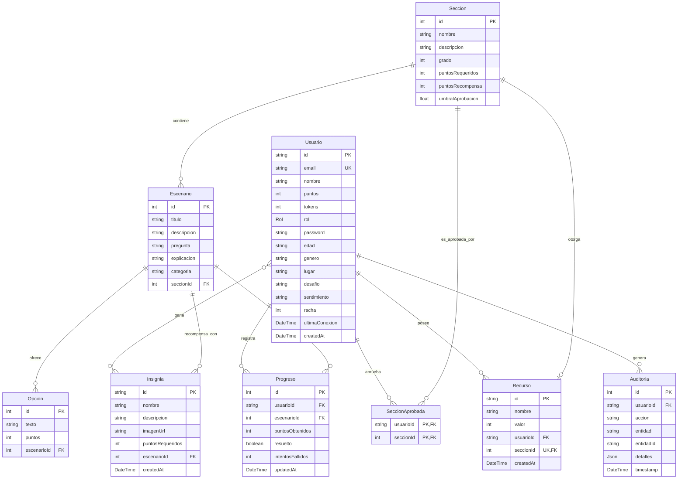

---


### Diagrama de Clases

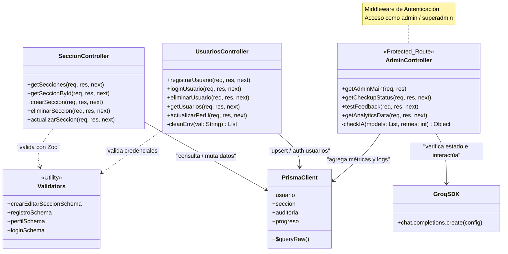

---
### Historial

- Revisión de tecnologías y arquitectura propuesta.
- Planteo de Proyecto “Math-Path”.
- Planteo de uso de tecnologías ‘pnpm’ y Prisma.
- Planteo de despliegue Vercel “serverless”.
- Primer commit.
- Definición e implementación de Stack.
  · Configuración de modelo y entorno para la base de datos remota (Prisma).
- Esquema de entidades: Usuarios, Sección, Escenario.
  . Lógica en controladores de Secciones y Escenarios.
  · Lógica en controladores de Usuarios, Admin y Superadmin.
- Documentación en “Back-End Readme.md”.
- Actualización en repositorio
- Configuración de Bd de test en PostgreSQL.
  · Migración de esquema ‘Prisma’.
  · Sembrado de datos mock.
  · Configuración de ‘Auth’.
- Configuración e implementación de ‘servidor modular local’ funcional.
- Listado e implementación de endpoints base para testing y pruebas de impacto.
- Actualización de Documentación y repositorio.
- Implementación de Test de LogIn y Registro.
  · Test “local” de ruteo del CRUD de endpoints.
  · Branch de oficio, acceso para Q&A.
- Infraestructura para Prueba de Concepto.
  · Cuentas Google, Supabase y Vercel.
- Inicio de implementación de validaciones.
  · Implementación de biblioteca y esquemas de validación Zod.
Actualización de Back-End en "main"
- Implementación de doble origen de datos
 · con archivos locales y WebDb
- Mecanismo para respuestas de inicio de sesión,
 · registro de usuarios persistente en archivo local
- Nodo administrativo (beta)
 · Gestión de estado Back-End
 · Gestión de asistencia CLI-LLM (beta)
 · Gestión de CRUDs de contenidos (beta)
 · Gestión de grafos estadísticos
Reunión con integrantes de Front-End y Q&A
Actualización de rama “producción-test” eliminando las implementaciones de simulación para Registro, Inicio de sesión y Db, actualización de Documentación
Test de despliegue de Producción activa en Vercel con conexión a WebDb
Revisión y optimización de Back-End

---


*Proyecto desarrollado para InnovaLab por el "Equipo 8" con integrantes multidisciplinarios de distintas extracciones relativas a la "Agencia de Habilidades para el Futuro" dependiente del Ministerio de Educación de la Ciudad Autónoma de Buenos Aires, entre Mayo y Agosto de 2026.*
